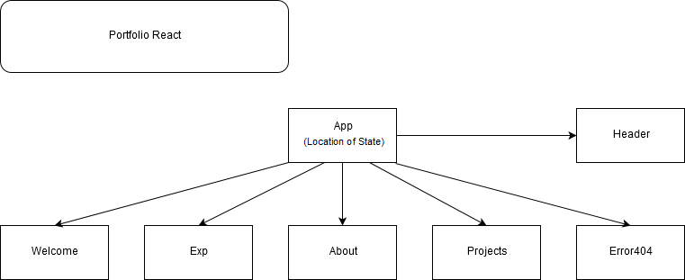

# _Personal Portfolio in React._

#### _A personal portfolio, done in React._

#### By _**Robert Lee**_

## Description

_A personal portfolio, done in React._

## Setup/Installation Requirements

* _Clone the applications from github by going to the terminal window command line and typing:_

$ git clone https://github.com/bobbydwise1/portfolio-react-week2.git

* _After all the files have been copied, navigate to the project working directory.  Type the following:_

$ npm install

* _Node Package Manager (npm) should automatically start downloading all required dependencies.  After all files have been downloaded, type the following:_

$ npm run start

* _The terminal window will run the server._

* _You must now go to your web browser to localhost:8080_

* _To stop the application, return to the terminal window and enter the command CTRL+C.  If prompted for (Y/N), pick "Y".  Then close the user interface tab in your web browser._

## Layout

* _The component tree consists of the following:_

## Known Bugs

* _Not really a bug, but React state has been inserted into the App Component for use in a future refactor._

## Support and contact details

* _Please contact bobbydwise1@hotmail.com_

## Technologies Used

* _Javascript, jQuery, HTML, CSS, Bootstrap, Atom, NPM, Webpack, React libraries, math.js library._

### License

*This application is Licensed under the MIT software License agreement. THE SOFTWARE IS PROVIDED "AS IS", WITHOUT WARRANTY OF ANY KIND, EXPRESS OR IMPLIED, INCLUDING BUT NOT LIMITED TO THE WARRANTIES OF MERCHANTABILITY, FITNESS FOR A PARTICULAR PURPOSE AND NON-INFRINGEMENT. IN NO EVENT SHALL THE AUTHORS OR COPYRIGHT HOLDERS BE LIABLE FOR ANY CLAIM, DAMAGES OR OTHER LIABILITY, WHETHER IN AN ACTION OF CONTRACT, TORT OR OTHERWISE, ARISING FROM, OUT OF OR IN CONNECTION WITH THE SOFTWARE OR THE USE OR OTHER DEALINGS IN THE SOFTWARE.*

Copyright (c) 2019 **_Robert Lee, Epicodus_**
